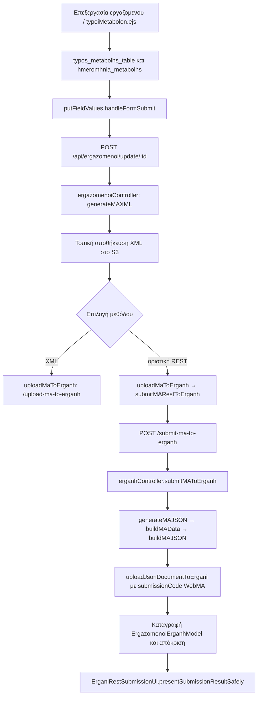

# Έλεγχος SweetAlert και MA REST — 2026-09-22

## Απογραφή SweetAlert

Η πλήρης απογραφή παράγεται κατ’ απαίτηση με `node server/audits/checkSweetAlertDialogs.js --inventory`. Περιλαμβάνει αρχείο, γραμμή, πλησιέστερη συνάρτηση, τίτλο, εικονίδιο, `customClass`, ρητό πλάτος και κατηγορία. Το εργαλείο `node server/audits/checkSweetAlertDialogs.js --inventory` την αναπαράγει. Οι 475 ενεργές κλήσεις διαφέρουν από τις 492 απλές λεκτικές εμφανίσεις, επειδή 17 εμφανίσεις βρίσκονται σε σχόλια ή ανενεργό κώδικα. Η κατηγοριοποίηση των EJS γίνεται από το κείμενο και χρειάζεται χειροκίνητη αναθεώρηση όταν αλλάζουν τα ενσωματωμένα σενάρια.

Κατηγορίες: 115 ERROR, 64 WARNING, 142 SUCCESS, 42 CONFIRMATION, 16 PROGRESS, 13 TOAST, 3 PDF_PREVIEW, 4 COMPLEX_TABLE/PREVIEW, 3 INTENTIONAL_WIDE, 73 STANDARD. Οι 69 υφιστάμενοι απλοί διάλογοι χωρίς την πλήρη κλάση περιορισμού καλύπτονται από στοχευμένο κανόνα CSS. Ο στατικός έλεγχος κρατά ακριβή κατάλογο αυτών των υφιστάμενων θέσεων και απορρίπτει νέα θέση χωρίς κλάση. Τα ειδικά παράθυρα και τα ρητά πλάτη δεν υπάγονται στον περιορισμό.

Αιτία του μεγάλου παραθύρου WebMA: `showSubmissionError()` στο `erganiRestSubmissionUi.js` δεν όριζε `custom-swal-popup`, ενώ το γενικό `.swal2-popup` είχε `width: auto !important`. Το μήνυμα περνούσε από HTML escaping, αλλά τα κυριολεκτικά `\\n` δεν γίνονταν αλλαγές γραμμής. Ο νέος formatter πρώτα κάνει escaping και έπειτα μετατρέπει πραγματικές και κυριολεκτικές αλλαγές γραμμής σε ` `. Η ίδια εμφάνιση καλύπτει επιτυχία χωρίς PDF και εφεδρικό σφάλμα παρουσίασης. Η προεπισκόπηση PDF κρατά ειδικό προσαρμοζόμενο πλάτος. Η αφαίρεση του `!important` από το γενικό `width: auto` επιτρέπει ξανά τα υπάρχοντα ρητά πλάτη· αυτό ελέγχθηκε σε Chromium.

## Πραγματική ροή MA

Η οριστική REST διαδρομή **δεν** καλεί το `/upload-ma-to-erganh`. Το XML δημιουργείται κατά την ενημέρωση του εργαζομένου και αποθηκεύεται στο S3, αλλά δεν αποστέλλεται προσωρινά στο ΕΡΓΑΝΗ από αυτή τη διαδρομή. Μια προγενέστερη, χωριστή δοκιμή XML ή άλλη χειροκίνητη υποβολή δεν μπορεί να αποκλειστεί χωρίς καταγραφικά.

## Σύγκριση συνθετικού σεναρίου

Το σενάριο χρησιμοποιεί μόνο συνθετικά στοιχεία, επίσημο κωδικό μεταβολής ειδικότητας `009` και ημερομηνία `2026-09-22`. Το `buildMAData()` τροφοδοτεί τόσο το τοπικό XML όσο και το WebMA JSON, οπότε τα παρακάτω πεδία συμφωνούν για **την ίδια** ρητή ημερομηνία:

| Πεδίο | XML | WebMA JSON |
| --- | --- | --- |
| `f_date_metabolhs` | `22/09/2026` | `22/09/2026` |
| `f_eidikothta` | `123456` | `123456` |
| `f_eidikothta_anal` | συνθετική περιγραφή | ίδια |
| `f_basics_acceptance` | `0` | `0` |
| `f_file` | κενό | `null` |
| `TypesMetabolonMA[].f_typos_metabolhs` | `009` | `009` |
| `f_eidos_dieuthethshs` | `2` | `2` |
| `f_periodos_anaforas_from/to` | κενά | κενά |
| κωδικός υποκαταστήματος | `00001` | `00001` |
| κωδικός υποβολής | τοπική διαδρομή MA XML, process `230` ή `231` | `WebMA`, log process `ma_230` ή `ma_127` |

Η σύγκριση **πριν από τη διόρθωση** είχε μία ουσιαστική ασυμφωνία στην πραγματική ροή: το XML έπαιρνε `formData.hmeromhnia_metabolhs`, αλλά το REST αίτημα δεν μετέφερε την ημερομηνία. Ο εξυπηρετητής κατέληγε σε ημερομηνία αλλαγής ωραρίου ή πρόσληψης. Πλέον η ίδια ημερομηνία μεταφέρεται και επικυρώνεται πριν από το WebMA αίτημα. Ελλείπουσα ή αδύνατη ημερομηνία απορρίπτεται με HTTP 400.

Η νέα πρόσληψη E3N έχει ανεξάρτητη ημερομηνία: το `generateE3NJSON()` θέτει `f_proslipsidate` από `hmeromhnia_proslhpshs`. Συνθετική δοκιμή με διαφορετική `hmeromhnia_metabolhs` επιβεβαιώνει ότι δεν αλλάζει η ημερομηνία πρόσληψης, ενώ η έλλειψη `hmeromhnia_proslhpshs` απορρίπτεται.

## Αποδοχή όρων, αρχεία και τύπος μεταβολής

Ο [δημόσιος οδηγός του Υπουργείου](https://static-ypakp-gr-gefufeabdmg3ggcs.a01.azurefd.net/staticfiles/trialv2/Ergani%20II_Extended_Manual_13.02.2026.pdf) ορίζει: `001` = «Μεταβολή αποδοχών λόγω αλλαγής νομοθεσίας», `009` = «Μεταβολή ειδικότητας». Για τον τύπο `001` αναφέρει ότι η αποδοχή δεν απαιτείται. Για τις λοιπές μεταβολές περιγράφει αποδοχή μέσω MyErgani ή με επισυναπτόμενη υπογεγραμμένη δήλωση. Δεν εκθέτει τις αριθμητικές τιμές `0/1/2` του `f_basics_acceptance`. Ο τοπικός πίνακας `Oysiodeis_Oroi` και ο πίνακας `Typoi_Metabolon` δεν ήταν διαθέσιμοι μέσω ασφαλούς σύνδεσης μόνο για ανάγνωση. Άρα οι ακριβείς αριθμητικές αντιστοιχίσεις παραμένουν ανεπιβεβαίωτες από πρωτογενή δεδομένα του συστήματος.

Η υπάρχουσα λογική MA παραμένει: ένας μοναδικός τύπος `001` δίνει `f_basics_acceptance = '2'`, ενώ οι άλλοι τύποι χρησιμοποιούν το `ergazomenos.oysiodeis_oroi` ή, αν λείπει, `2`. Η σημασιολογία των αριθμών δεν άλλαξε. Το μοντέλο εγγράφων και οι διαδρομές αποθήκευσης διακρίνουν `oysiodeis_oroi` από `arxeio_symbashs`. Ο E3N v2 τροφοδοτεί το `f_file` από το αρχείο ουσιωδών όρων και το `f_file_symbash` από το αρχείο σύμβασης. Σε συμφωνία με τον οδηγό, το MA `f_file` πλέον διαβάζει το `arxeio_apodoxhs_oysiodon_oron_path`. Το κενό ή `AA==` εξακολουθεί να μετατρέπεται σε `null` στο REST. Χωρίς επαληθευμένη αριθμητική αντιστοίχιση και πραγματικά δεδομένα περιστατικού δεν προστέθηκε νέο mode-specific preflight για συνδυασμό αποδοχής/αρχείου.

## Διπλή αναγγελία και καταγραφικά

Στο `putFieldValues.js` υπήρχε ένας ακροατής `click` για κάθε `.submitButton` και μία κλήση `submitMARestToErganh()` ανά REST κλάδο. Το `erganiUploadInProgress` αποτρέπει ταυτόχρονη αποστολή μόνο όσο εκτελείται η αποστολή. Προστέθηκε κοινό κλείδωμα από την αρχή της επεξεργασίας του κουμπιού έως το τέλος της αποθήκευσης και παρουσίασης αποτελέσματος. Δοκιμή αλληλεπίδρασης σε Chromium με δύο γρήγορα πατήματα και προσομοιωμένο WebMA POST επαληθεύει μία κλήση και επαναφορά του κλειδώματος μετά από επιτυχία και αποτυχία. Η συγκεκριμένη αιτία του μηνύματος περί υπάρχουσας αναγγελίας παραμένει μη αποδεδειγμένη: μπορεί να σχετίζεται με την προηγούμενη λανθασμένη ημερομηνία ή με προηγούμενη υποβολή.

Δεν βρέθηκαν τοπικά καταγραφικά WebMA ή MA XSD/δείγματα. Δεν χρησιμοποιήθηκε σύνδεση παραγωγικής βάσης ούτε αναγνώστηκαν αρχεία `.env`. Το αναφερθέν περιστατικό BLG / εταιρεία 0007 / εργαζόμενος 0229 δεν επαληθεύτηκε από καταγραφές παραγωγής. Για εξακρίβωσή του χρειάζεται εξουσιοδοτημένη, μόνο για ανάγνωση πρόσβαση στις καταχωρίσεις `ErgazomenoiErganhModel` και στις συλλογές σταθερών κωδικών, με απόκρυψη ταυτότητας και πλήρων φορτίων.
